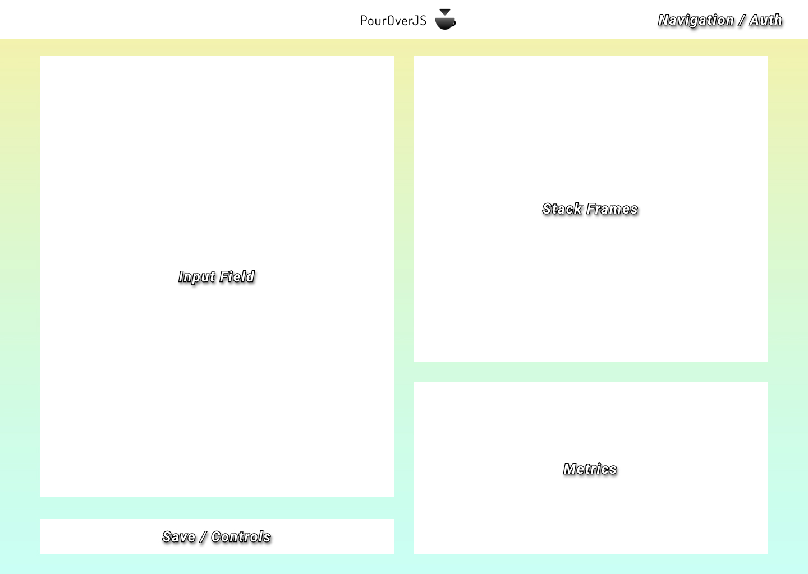

# PourOverJS

  PourOverJS will be a `JavaScript` profiler and stack visualizer which allows users to test a block of code. It will analyze the individual components of the submitted code and display stack frames and metrics for each function.
  As a result, users will be able to identify inefficiencies, chokepoints, and debug their code more intuitively. Users will be able to save code snippets to the database and keep track of their functions.

## Minimum Viable Product
PourOverJS is a web application built using the MERN (MongoDB, Express.js, React.js-Redux, Node.js) stack. Within 7 days, this app will, at a minimum, satisfy the following criteria with smooth, bug-free navigation and sufficient CSS styling:

  - [ ] Heroku Hosting
  - [ ] Authentication
  - [ ] Code input
  - [ ] JS Stackframes
  - [ ] Performance metrics
  - [ ] Code examples
  - [ ] Code CRUD
  - [ ] Production README


## Wireframe
  

## Technologies

- FRONT END:
	- React.js with Redux

- BACK END:
	- Node.js
	- Express.js  
	- MongoDB

- NPM PACKAGES/OTHER LIBRARIES:
  - Webpack
  - Nodemon
  - BodyParser
  - EJS
  - BCrypt/SCrypt

## Weekend Accomplishments

  Completion of a prototype application using the MERN stack following the CRUD principles of software development. Users have the ability to post, edit, and delete comments which render in real time using the React virtual DOM.

  [Live][crud_proto]

## API Endpoints

### Root

- `Get /` - loads React web app

## JSON API

### Users

- `POST /api/users`

### Session

- `POST /api/session`
- `DELETE /api/session`

### Code

- `GET /api/users/:name/code`
- `POST /api/users/:name/code`
- `PATCH /api/users/:name/code/:name`
- `DELETE /api/users/:name/code/:name`

## Schema

``` Javascript

{
	username: {
  	session_token: "klsj24dflk45gewj45gkalsn",
    password_digest: "aghb24skdnk435sdf",
    code: {
    	filename: "Some-code"
    }
  }
}
```

## Sample State

``` Javascript

{
	username: {
    code: {
    	filename: "Some-code"
    }
  }
}
```

## Implementation Timeline
We are using the `Scrum framework` of `Agile Development`. By design, we will not plan our second `Sprint` until completion of the first `Sprint`.

### Sprint 1:  (4 days)

#### Day 2

  * **Justin:** Stack Frames and stop JS asychronicity
  * **Xiaoyuan:** Stack Frames and stop JS asychronicity
  * **Arvind:** Stack Frames and stop JS asychronicity
  * **Atom:** Stack Frames and Syntax Highlighting

#### Day 3

  * **Justin:** Stack Frames and stop JS asychronicity
  * **Xiaoyuan:** Stack Frames and stop JS asychronicity
  * **Arvind:** Stack Frames and and stop JS asychronicity
  * **Atom:** Style Stack Frames

#### Day 4

  * **Justin:** Event Loop
  * **Xiaoyuan:** Event Loop
  * **Arvind:** Examples, Function Metrics
  * **Atom:** Function Metrics

### Sprint 2:  (3 days)
SEE ABOVE, TBD

#### Day 5

  * **Justin:**
  * **Xiaoyuan:**
  * **Arvind:**
  * **Atom:**

#### Day 6

  * **Justin:**
  * **Xiaoyuan:**
  * **Arvind:**
  * **Atom:**


#### Day 7

  * **Justin:**
  * **Xiaoyuan:**
  * **Arvind:**
  * **Atom:**

### Bonus Features (TBD)
- [ ] Use D3.js to display performance metrics
- [ ] Allow sign in through GitHub account
- [ ] Optimized Implementation for each example and efficiency comparisons


[crud_proto]: https://github.com/aravi3/MERN_CRUD_Application
